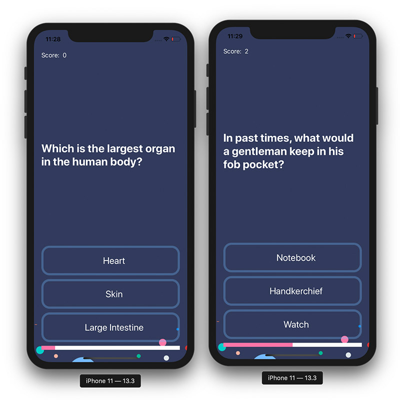

#  Quizzler iOS 13

## Description

I developed this simple iOS 13 app as a project to learn and apply MVC design pattern using Swift.
Quizzler is a trivia quiz app. It consists of a series of multiple-choice, genenral knowledge questions, but can be tailored to fit any certain topic. It uses a progress bar to display progress through the quiz, and has a score counter that resets at the end of each quiz. The app logic is extremely simple, since the project was only created to practice MVC pattern using Swift.

The UI belongs to The App Brewery, since this project was a part of The App Brewery's Udemy iOS 13 bootcamp. www.appbrewery.co

